<div align="center">
  <a href="https://github.com/CrowForKotlin/CopyManga_Crow">
    
  </a>

<h3 align="center">⭐⭐⭐CopyMangaX⭐⭐⭐</h3>
</div>

<p>


</p>

[](https://t.me/+kFkVVuDOFsFiMzQ1)

**```如果你需要Clone该项目，在Clone完成后请进入到该项目的根目录下并输入git submodule update --init --recursive更新子模块才可继续执行编译```**

- ### **🔶 前言**
    - **🟠 数据来源于拷贝漫画 作者不对其中呈现的任何内容负责。**
    - **🔷 项目介绍**
        - **🟠 项目采用 <u>多模块</u> 和 <u>MVI框架</u> 开发**
        - **🟠 此项目非常注重代码质量、重构有十次左右了 从最初的MVC --> MVVM --> MVI 都是借鉴了自己以前的项目去实现**

- ### **🔶 关于项目**
    - **🔷 [Dev分支可预览最新的开发进度](https://github.com/CrowForKotlin/CopyManga_Crow/tree/dev)**
    - **🔷 设计ICON、二次创新ICON、框架 --> crowforkotlin**

- ### **❓问题或方案参考及开源贡献**
    - **✅[Mihonapp - Author : mihon](https://github.com/mihonapp/mihon)**
    - **✅[Kotatsu - Author : KotatsuApp](https://github.com/KotatsuApp/Kotatsu)**

#### 阅读器（支持屏幕旋转、缩放）
<table>
	<tr>
		<td align="center">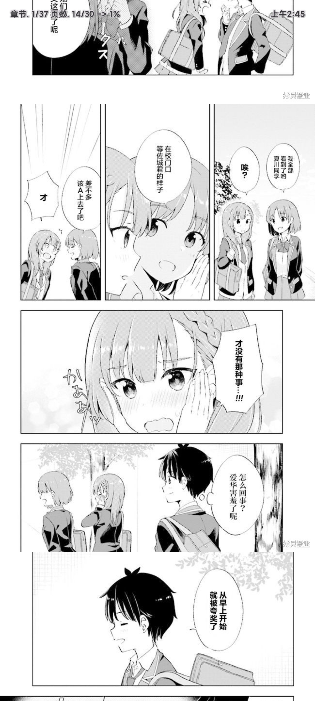</td>
		<td align="center">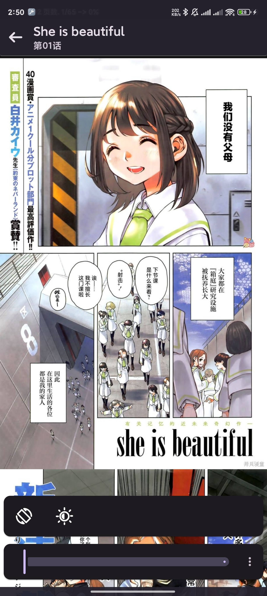</td>
		<td align="center">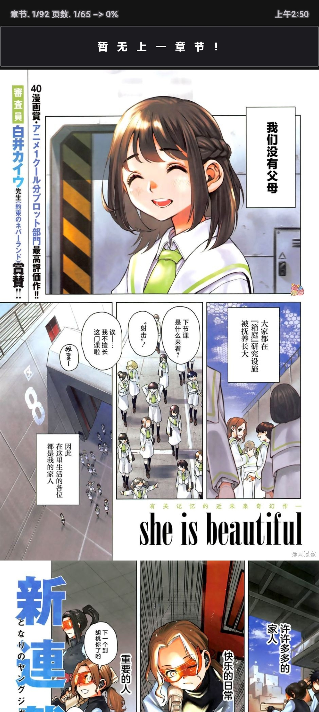</td>
		<td align="center">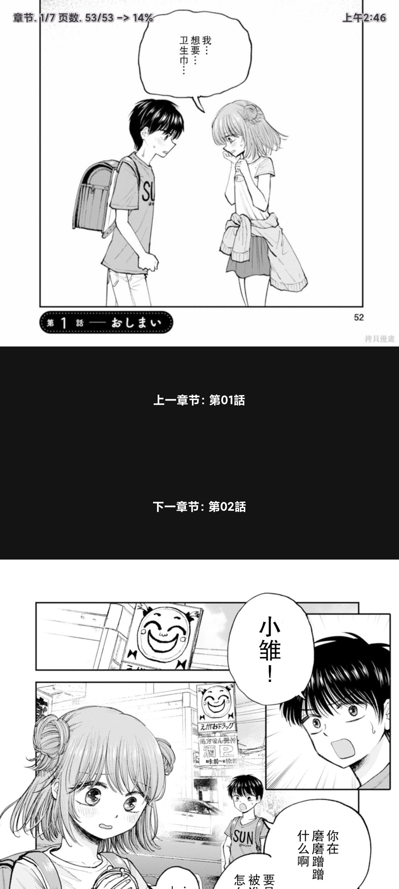</td>
	</tr>
    <tr>
		<td align="center">默认状态</td>
		<td align="center">选项</td>
        <td align="center">默认经典</td>
        <td align="center">无限条漫</td>
	</tr>
</table>

#### 浅色模式
<table>
	<tr>
		<td align="center"></td>
		<td align="center">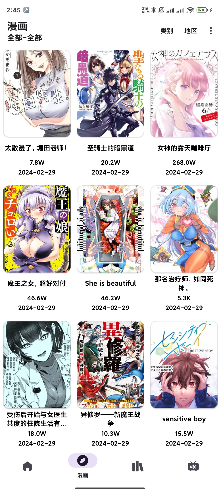</td>
		<td align="center">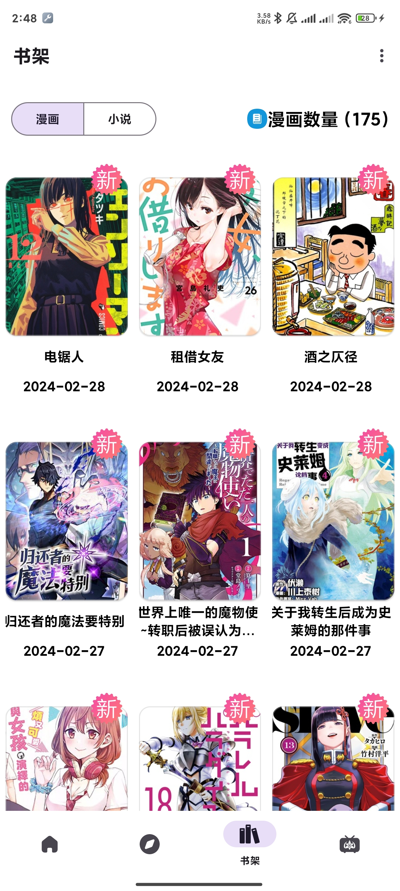</td>
		<td align="center">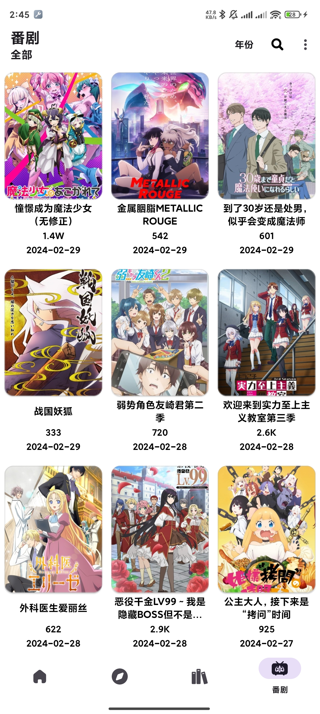</td>
	</tr>
    <tr>
		<td align="center">主页</td>
		<td align="center">漫画</td>
        <td align="center">书架</td>
        <td align="center">番剧</td>
	</tr>
</table>
<table>
	<tr>
		<td align="center">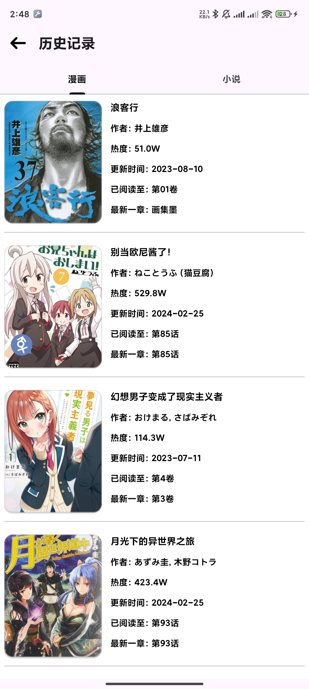</td>
		<td align="center">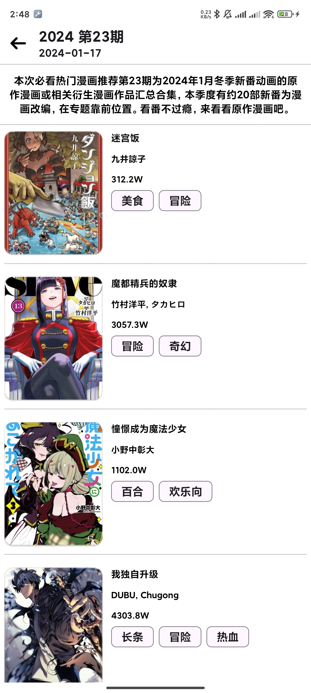</td>
		<td align="center">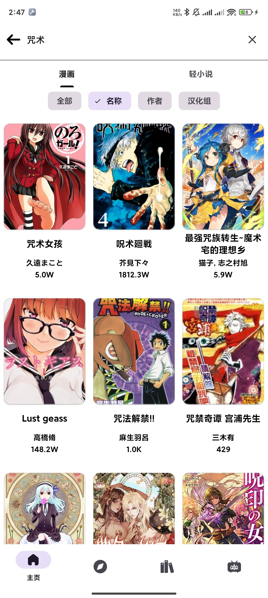</td>
		<td align="center">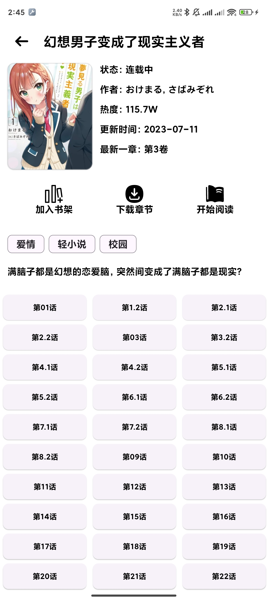</td>
	</tr>
    <tr>
		<td align="center">历史记录</td>
		<td align="center">专题</td>
        <td align="center">搜索</td>
        <td align="center">漫画信息</td>
	</tr>
</table>

#### 深色模式
<table>
	<tr>
		<td align="center">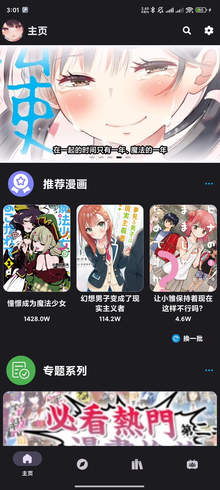</td>
		<td align="center">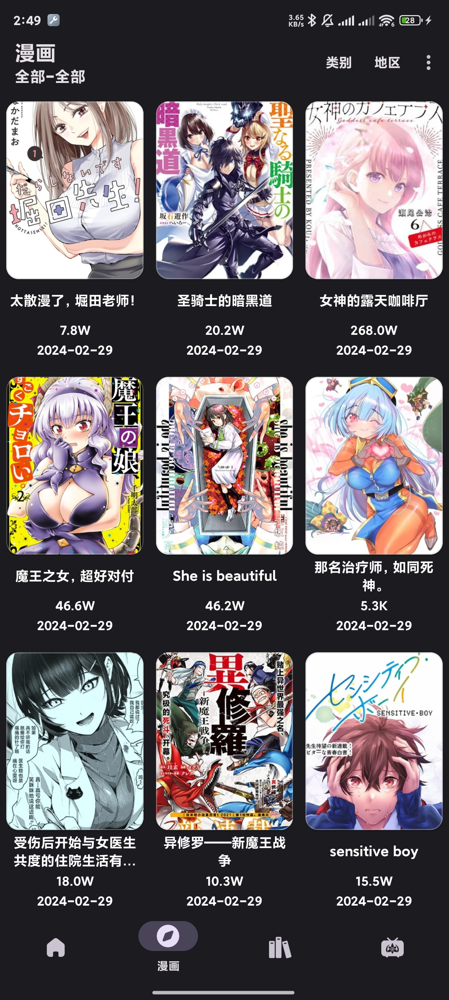</td>
		<td align="center">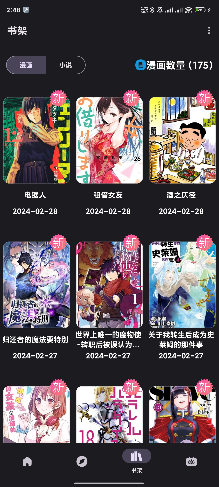</td>
		<td align="center">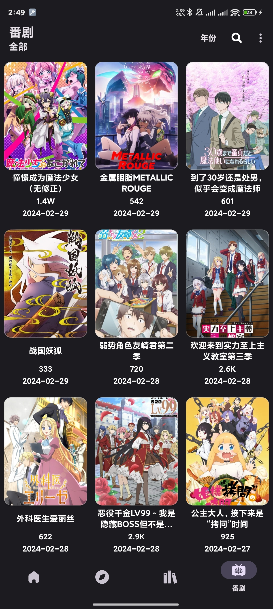</td>
	</tr>
    <tr>
		<td align="center">主页</td>
		<td align="center">漫画</td>
        <td align="center">书架</td>
        <td align="center">番剧</td>
	</tr>
</table>
<table>
	<tr>
		<td align="center">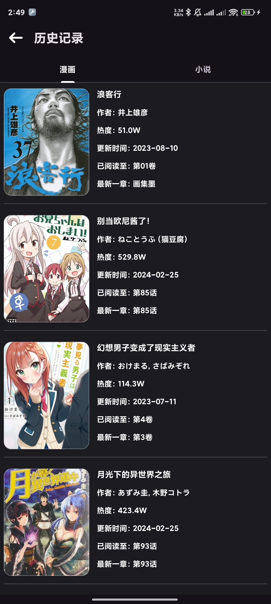</td>
		<td align="center">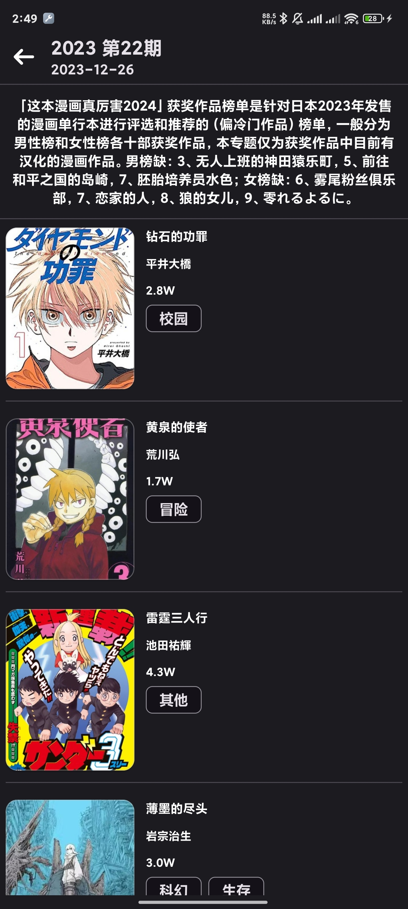</td>
		<td align="center">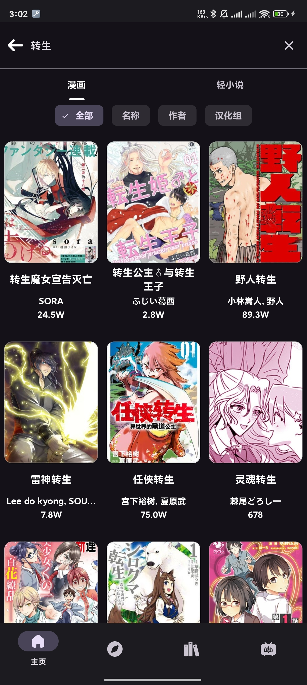</td>
		<td align="center">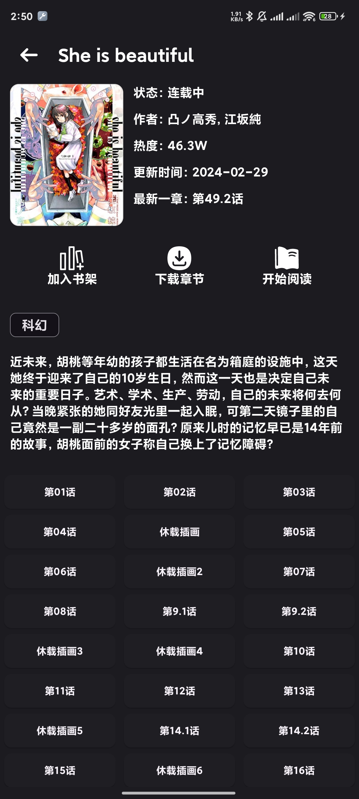</td>
	</tr>
    <tr>
		<td align="center">历史记录</td>
		<td align="center">专题</td>
        <td align="center">搜索</td>
        <td align="center">漫画信息</td>
	</tr>
</table>