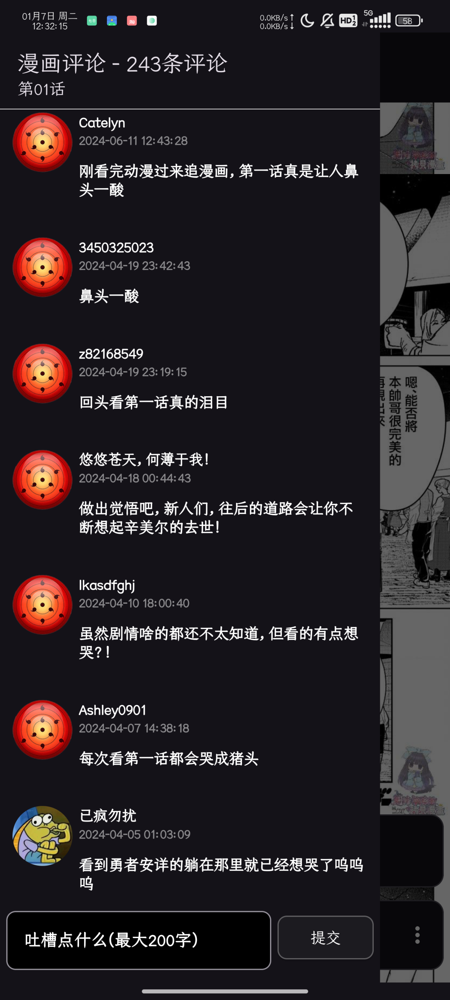
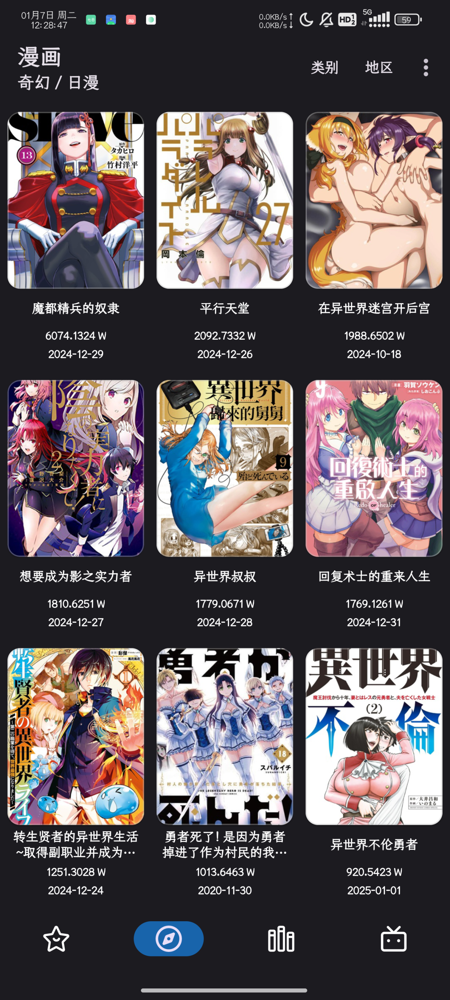
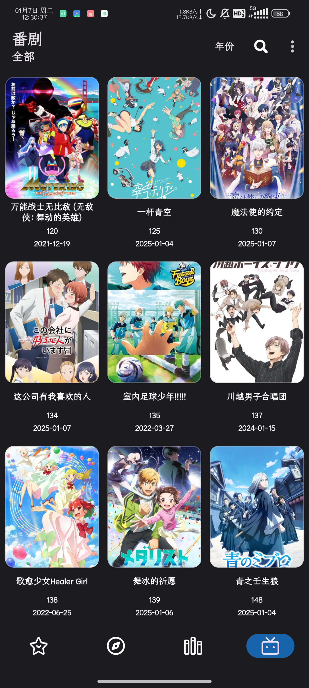
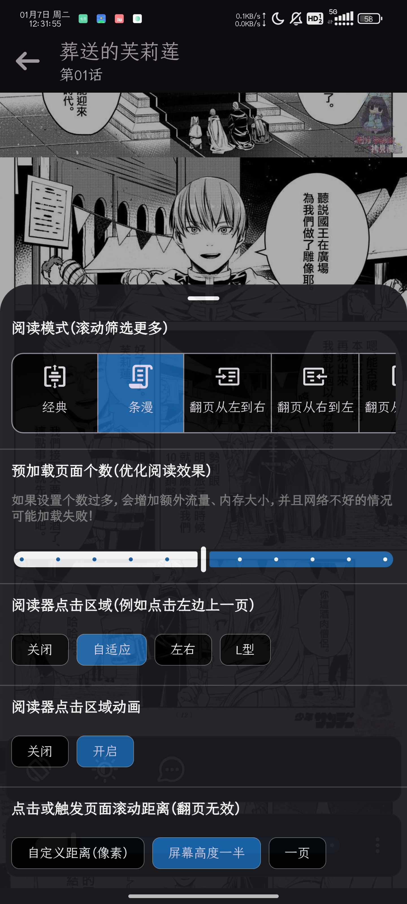
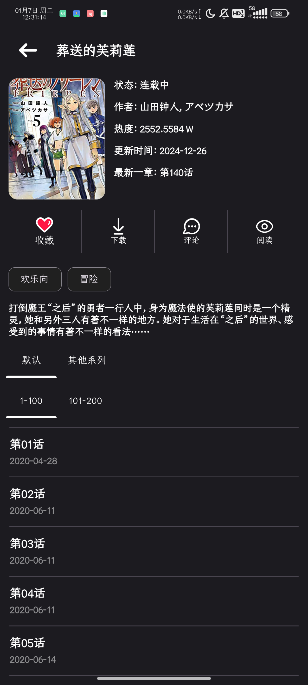

  

<h3 align="center">⭐⭐⭐PasteMangaX⭐⭐⭐</h3>

- **Almost no one looks at the problem from your point of view, it's just for their own interests, in the final analysis, the problem is still in yourself!**

- **There are always people who want to steal your stuff and do even more shameless things!**

- **The project is for learning only, commercial use is prohibited!**

- ### **Question or solution references and open source contributions**
  - **✅[Mihonapp - Author : mihon](https://github.com/mihonapp/mihon)**
  - **✅[Kotatsu - Author : KotatsuApp](https://github.com/KotatsuApp/Kotatsu)**
  
- ### **comic reader support screen,rotation,zoom**

#### dark mode 
<table>
	<tr>
		<td align="center"></td>
		<td align="center"></td>
		<td align="center"></td>
		<td align="center"></td>
	</tr>
    <tr>
		<td align="center">reader mode</td>
		<td align="center">manga click area.png</td>
        <td align="center">manga full comment</td>
        <td align="center">search list</td>
	</tr>
</table>
<table>
	<tr>
		<td align="center"></td>
		<td align="center"></td>
		<td align="center"></td>
		<td align="center"></td>
	</tr>
    <tr>
		<td align="center">home page</td>
		<td align="center">comic</td>
        <td align="center">bookshelf</td>
        <td align="center">anime</td>
	</tr>
</table>
<table>
	<tr>
		<td align="center"></td>
		<td align="center"></td>
		<td align="center"></td>
		<td align="center"></td>
	</tr>
    <tr>
		<td align="center">manga reader</td>
		<td align="center">manga info</td>
        <td align="center">manga comment</td>
        <td align="center">topic_list</td>
	</tr>
</table>