<div align="center">
  <a href="https://github.com/CrowForKotlin/CopyManga_Crow">
    
  </a>

<h3 align="center">⭐⭐⭐CopyMangaX⭐⭐⭐</h3>
</div>

<p>


</p>

[](https://t.me/+kFkVVuDOFsFiMzQ1)

**```如果你需要Clone该项目，在Clone完成后请进入到该项目的根目录下并输入git submodule update --init --recursive更新子模块才可继续执行编译```**

- ### **🔶前言**
    - **🟠数据来源于拷贝漫画 作者不对其中呈现的任何内容负责。**
    - **🔷项目介绍**
        - **🟠项目采用 <u>多模块</u> 和 <u>MVI框架</u> 开发**
        - **🟠此项目非常注重代码质量、重构有十次左右了 从最初的MVC --> MVVM --> MVI 都是借鉴了自己以前的项目去实现**

- ### **🔶关于项目**
    - **🔷[Dev分支可预览最新的开发进度](https://github.com/CrowForKotlin/CopyManga_Crow/tree/dev)**
    - **🔷App的所有Icon几乎都是作者二改、V1.1.0二次设计、V1.2.5三次设计**
    - **🔷目前仅一人开发，欢迎Pull Request**
    - **🔷在今后或许会新增一些新技术、扩展接口及功能模块**

- ### **❓问题或方案参考及开源贡献**
    - **✅[copymanga - Author : fumiama](https://github.com/fumiama/copymanga)**
    - **✅[CopyMangaJava - Author : shizheng233](https://github.com/shizheng233/CopyMangaJava)**
    - **✅[Tachiyomi - Author : tachiyomiorg](https://github.com/tachiyomiorg/tachiyomi)**
    - **✅[Kotatsu - Author : KotatsuApp](https://github.com/KotatsuApp/Kotatsu)**
    - **✅[自定义可缩放RecyclerView By Custom LayoutManager（已弃用、这计算原理过于复杂且参考代码可读性糟糕）](https://ekibun.github.io/ekibook/2020/03/19/scalablelayoutmanager/)**
    - **✅[自定义可缩放RecyclerView By Canvas（缺陷多、1.1.0前版本都是该实现）](https://github.com/AhaochGan/GalleryView)**
    - **✅[LoadingButton内存泄露（已修复）](https://github.com/leandroBorgesFerreira/LoadingButtonAndroid/issues/144#issuecomment-585668460)**
    - **✅[Add Glide TransitionAnimation](https://github.com/bumptech/glide/issues/692)**

#### 浅色模式
<table>
	<tr>
		<td align="center">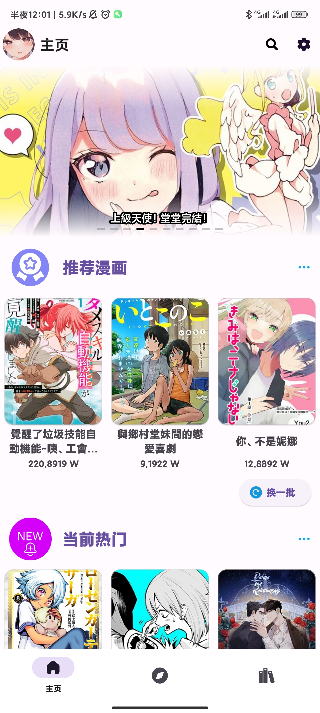</td>
		<td align="center">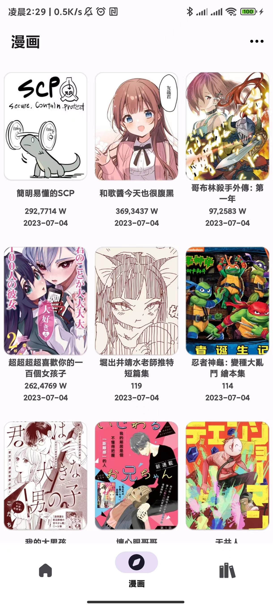</td>
		<td align="center">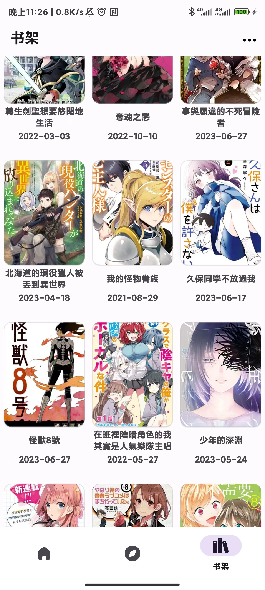</td>
	</tr>
    <tr>
		<td align="center">主页</td>
		<td align="center">漫画</td>
        <td align="center">书架</td>
	</tr>
</table>
<table>
	<tr>
		<td align="center"></td>
		<td align="center">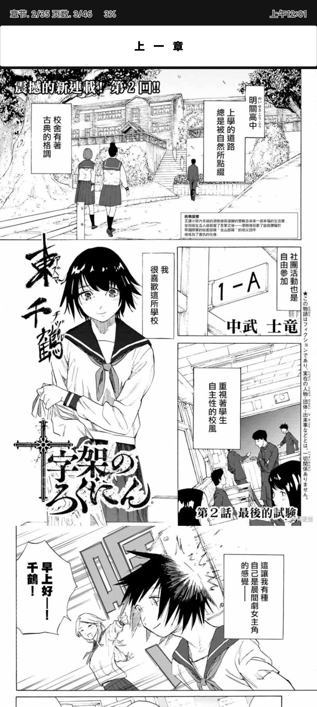</td>
		<td align="center">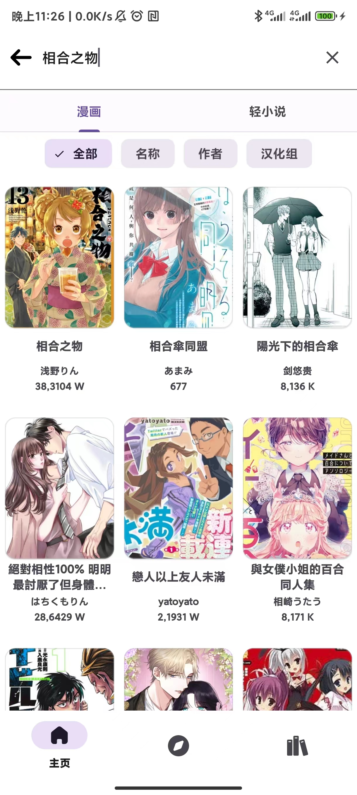</td>
	</tr>
    <tr>
		<td align="center">漫画信息</td>
		<td align="center">漫画页-支持横竖屏-缩放</td>
        <td align="center">搜索</td>
	</tr>
</table>

#### 深色模式
<table>
	<tr>
		<td align="center">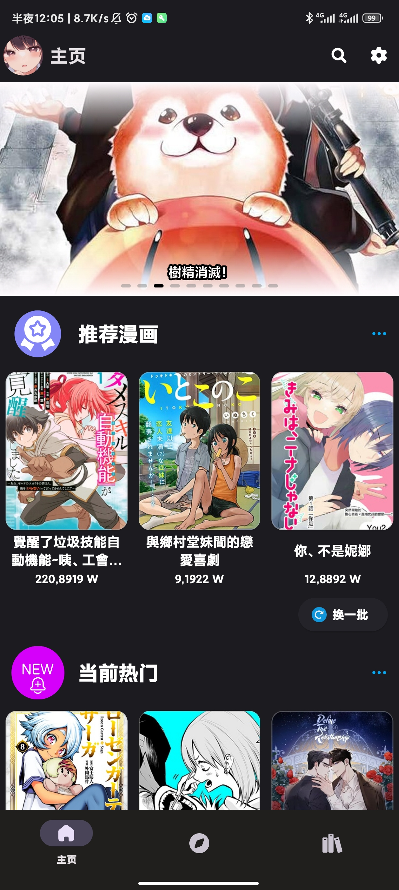</td>
		<td align="center">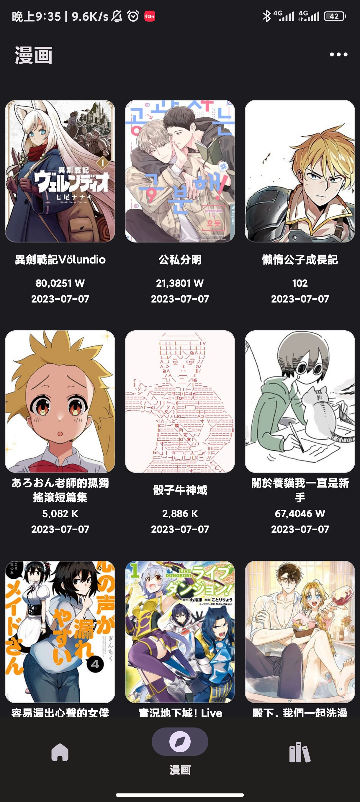</td>
		<td align="center">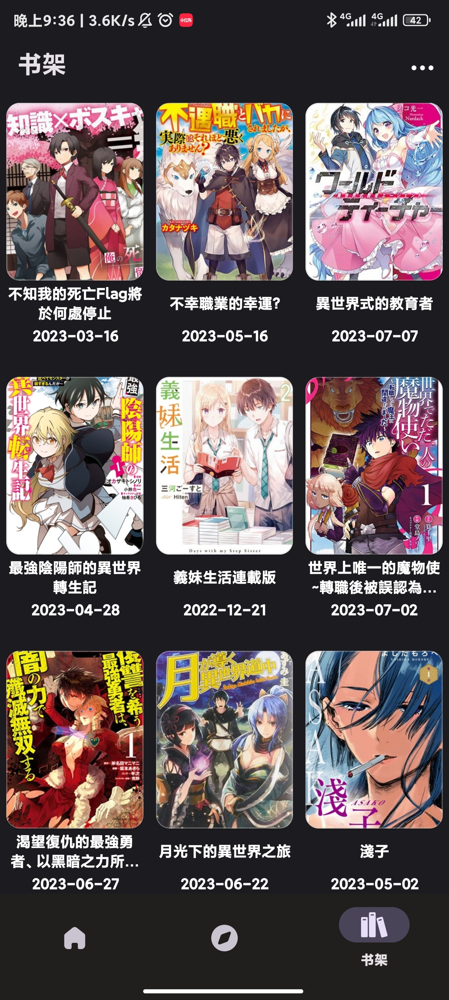</td>
	</tr>
    <tr>
		<td align="center">主页</td>
		<td align="center">漫画</td>
        <td align="center">书架</td>
	</tr>
</table>
<table>
	<tr>
		<td align="center">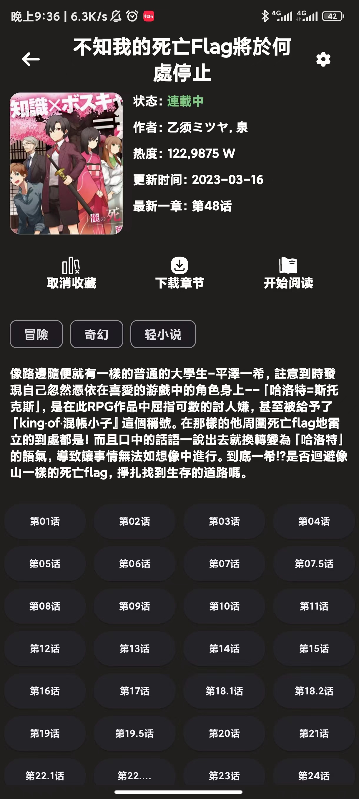</td>
		<td align="center">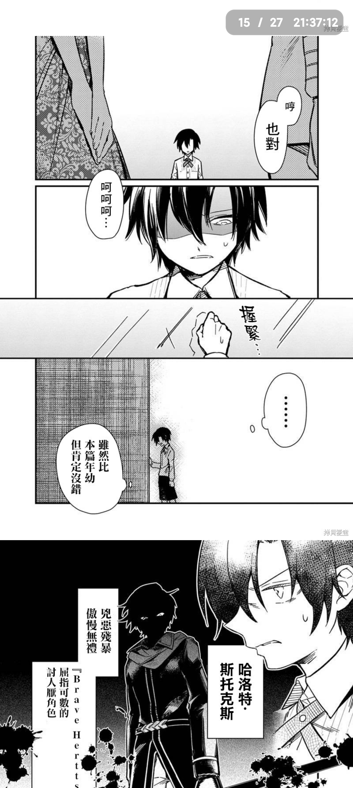</td>
		<td align="center">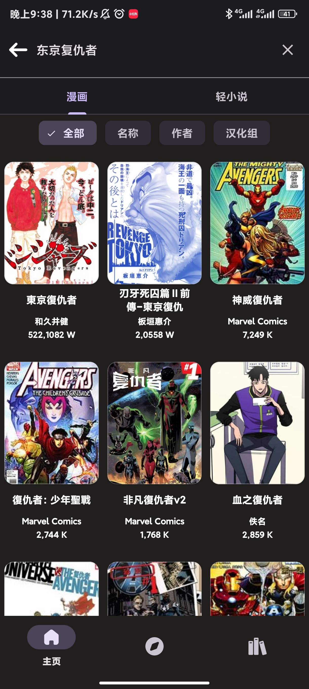</td>
	</tr>
    <tr>
		<td align="center">漫画信息</td>
		<td align="center">漫画页-支持横竖屏-缩放</td>
        <td align="center">搜索</td>
	</tr>
</table>